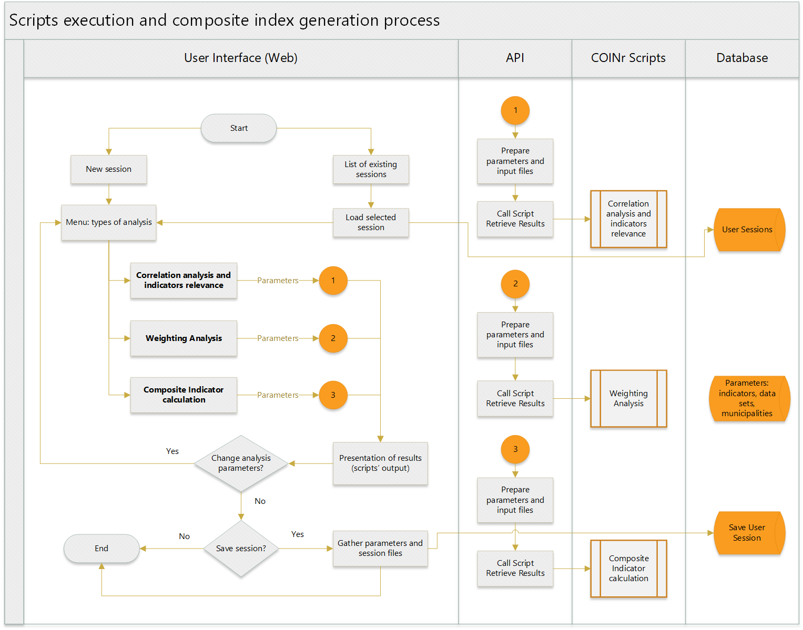
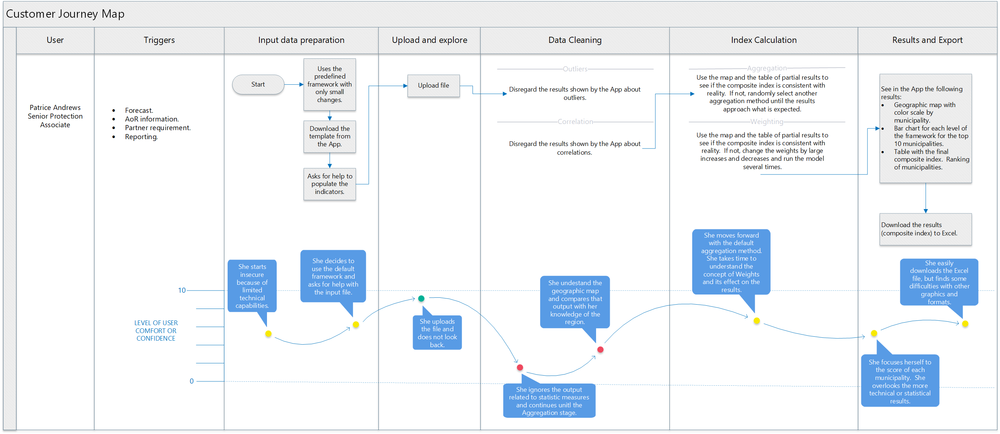
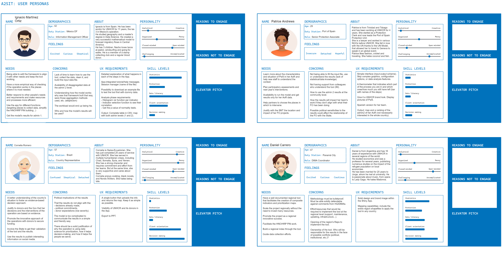
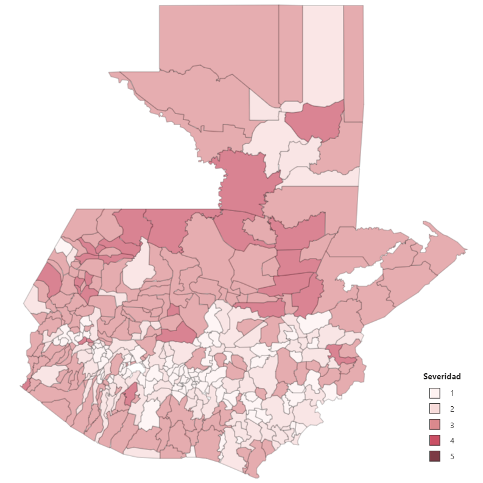

# 🌍 A2SIT — Tool for Community Prioritization and Vulnerability Analysis

---

## 📌 Project Overview

**A2SIT** (Area-based Analysis Supporting Identification Tool) is an open-source, data-driven web application developed by **UNHCR's Innovation Unit** in partnership with **UNHCR Guatemala**. The tool enables humanitarian actors to build composite vulnerability indices and prioritize communities in need of protection interventions — transforming complex, multi-dimensional data into clear, actionable maps and rankings.

A2SIT was designed to be flexible and replicable across countries, allowing field teams and information management specialists to upload their own datasets, define custom analytical frameworks, and generate severity scores at the sub-national level (Admin Level 1 and 2) within seconds.

> 🔗 **Repository:** [UNHCR-Guatemala/A2SIT](https://github.com/UNHCR-Guatemala/A2SIT)

---

## 🏔️ Business / Humanitarian Scenario

### The Problem

Guatemala is a country of origin, transit, and destination for people in human mobility situations. Between January and August 2022 alone, more than **1.6 million apprehensions or inadmissible persons** were recorded at the US southern border — with hundreds of thousands originating from or transiting through Guatemala (including people from Guatemala, Honduras, El Salvador, Cuba, Venezuela, Nicaragua, and Haiti). *(Figures reflect data available at the time of the 2023 HNO process.)*

In this context, **Community-based Protection (CbP)** interventions are a key instrument for UNHCR. However, the diversity of local contexts across Guatemala, combined with limited resources, made it extremely difficult to have a **homogeneous, standardized, and replicable approach** for deciding which communities should receive assistance first.

### Why It Matters

Without a rigorous, data-driven prioritization methodology:
- Field teams relied on subjective judgment or incomplete information.
- Resources were sometimes allocated inefficiently.
- The process was not reproducible or auditable by other humanitarian actors.
- Coordination with other UN agencies and NGOs during processes like the **Humanitarian Needs Overview (HNO)** was slow and inconsistent.

A2SIT addresses all of these challenges by providing a **transparent, evidence-based, and replicable** framework for community prioritization.

---

## 💡 Solution Overview

A2SIT is a **Shiny-based web application** built in **R** using the **COINr** package — an advanced statistical framework for constructing, analyzing, and visualizing composite indicators. The tool allows users to:

- **Upload** country-specific datasets in a structured Excel template.
- **Define** a hierarchical index framework with custom dimensions and indicators.
- **Process** data automatically (normalization, imputation, aggregation).
- **Explore** results through interactive maps, ranked tables, and indicator profiles.
- **Compare** regions, scenarios, and aggregation methods side by side.
- **Export** results in Excel or image format for use in reports and presentations.

The composite index is structured around four analytical dimensions:

| Dimension | Description |
|---|---|
| **Vulnerability** | Poverty, disability, food insecurity, ethnic minority population, overcrowding |
| **Threats** | Crime rates, domestic violence, organized crime, conflict, natural disasters |
| **Response Capacity** | Education quality, healthcare access, institutional presence, public services |
| **Human Mobility** | Refugees and asylum-seekers, transiting populations, displacement indicators |

---

## 🏗️ Architecture

The application follows a **multifunctional flow** designed to accommodate both technical and non-technical users within a humanitarian data workflow.

*Multifunctional flow diagram showing the end-to-end process across user roles and system components.*

### Architectural Approach

The architecture separates the process into clear, sequential stages that map directly to the application's tab structure:

1. **Data Ingestion** — Users select a country and upload an Excel file containing indicator values and metadata. A downloadable template ensures data is structured correctly before upload.
2. **Framework Definition** — The hierarchical structure (dimensions → sub-indicators → composite index) is defined within the Excel template and interpreted by COINr at runtime.
3. **Automated Processing** — COINr handles data quality checks, missing value imputation, normalization to a 0–100 scale, weight assignment, and aggregation using configurable methods (arithmetic mean, geometric mean, etc.).
4. **Exploratory Analysis** — An indicator-by-indicator view allows users to review distributions, outliers, and data quality before finalizing the index.
5. **Results Visualization** — An interactive map displays composite index results and individual dimensions at Admin Level 2. Users can select and compare specific municipalities.
6. **Municipal Profiles** — Detailed profiles show each municipality's ranking, score, and breakdown by dimension and indicator.
7. **Scenario Comparison** — Advanced users can compare different aggregation methods or parameter configurations to assess model sensitivity.
8. **Session Persistence** — Users can save and reload sessions, preserving all configurations, data, and results for future use or sharing.

---

## ⚙️ Key Features / Functional Components

- **Flexible Country Support** — Select the country and download a country-specific data template; the same codebase supports any UNHCR operation worldwide.
- **Custom Index Frameworks** — Define entirely new analytical dimensions and indicators beyond the default Guatemala framework.
- **Data Quality Management** — Remove problematic indicators (status toggled to "Out") without restarting the analysis.
- **Multiple Aggregation Methods** — Switch between arithmetic mean, geometric mean, and other methods with immediate visual feedback on the map.
- **Interactive Choropleth Maps** — Download high-quality maps in image format for inclusion in reports and presentations.
- **Region Comparison** — Compare two municipalities side by side across all indicators and dimensions.
- **Scenario Comparison** — Evaluate different analytical configurations to understand how methodological choices affect results.
- **Full Data Export** — Export complete results to Excel for further processing or integration into broader humanitarian planning documents.

---

## 🙋 My Contributions

This project was a collaborative team effort. Below is a detailed account of my specific areas of involvement.

---

### 🤝 Team Building — Terms of Reference & Recruitment

One of my first contributions was designing the **Terms of Reference (TOR) for the Data Science Specialist using R** — an international consultant role critical to building the composite indicator model.

The TOR I drafted defined:
- The **operational context** (Guatemala displacement crisis, UNHCR's Community-based Protection mandate).
- The **technical scope**: building a composite indicator using the **COINr** R package across four phases — Preparation, Data Wrangling, Exploratory Data Analysis, and Statistical Modelling.
- The **deliverable structure** aligned with a Scrum-inspired sprint methodology (two sprints over 10 weeks), including a functional prototype, lessons learned, and high-level documentation.
- The **data sources to be reviewed**: Relative Wealth Index (Facebook), Social Connectivity Index, ACLED violence data, FAO drought indices, PreventionWeb disaster risk data, and demographic datasets.
- **Qualification requirements**: Master's degree in statistics/data science, advanced R skills, experience with composite indicators, and knowledge of UN statistical systems.
- **Intellectual property and confidentiality terms** aligned with UNHCR policy.

This TOR was published as an open call (deadline: November 13, 2022) and used to hire the data science consultant who built the first functional model sprints.

---

### 🏗️ Architecture & Design — Multifunctional Flow Analysis

I contributed to the **architectural analysis and design** of the A2SIT application, including producing the multifunctional flow diagram (shown in the Architecture section above). This deliverable represented the mapping of roles, data flows, and system interactions across the different components of the tool — from data ingestion through to result export. It informed how the application's tab structure was organized and how different user profiles (technical and non-technical) would navigate the tool.

> 📄 *Reference document: `Flujograma_multifuncional.png`*

---

### 🗺️ UX — Journey Maps

I led the creation of **Journey Maps** for the different user roles interacting with the A2SIT tool. Journey maps capture the step-by-step experience of each type of user — their goals, actions, pain points, and emotional states throughout the process.

*Journey map illustrating the experience of Protection (PRT) and Area-based Support Coordination (ASC) users interacting with the A2SIT tool.*

These journey maps were used to guide UX decisions, identify friction points, and ensure the tool met the needs of both **technical users** (information management specialists) and **non-technical users** (field protection officers).

---

### 👤 UX — User Personas

Complementing the journey maps, I defined the **User Personas** for A2SIT — fictional but data-informed profiles representing the key types of users who would interact with the tool.

*User personas defining the goals, backgrounds, technical capabilities, and needs of the primary A2SIT user types.*

User personas helped the development team maintain a user-centered focus throughout the design process, ensuring that both advanced analytical features and simple, guided workflows were adequately represented in the final product.

---

### 📊 Index Selection & Preprocessing

I was involved in the **selection and curation of indicators** for the composite vulnerability index. This work required balancing methodological rigor with practical data availability at the municipal level (Admin Level 2) across Guatemala.

The final selection of indicators was organized across the tool's four dimensions, drawing from authoritative international and regional data sources. The curated indicator list included:

| Category | Selected Indicators |
|---|---|
| **Conflict & Security** | Territorial conflict presence, organized crime, crime rate per 100,000, violence against women rate |
| **Disaster Risk** | Natural disaster exposure index (floods, cyclones, earthquakes, volcanoes) |
| **Human Mobility** | Refugees and asylum-seekers rate per 100,000, monthly transit population rate |
| **Socioeconomic** | Gini coefficient, poverty rate, unemployment rate, child labour rate |
| **Social Vulnerability** | Food and nutrition insecurity index, overcrowding, % of people with disabilities |
| **Ethnic & Indigenous** | % Mayan population, % Afro-descendant, % Xinca, % Garifuna |
| **Education** | % with completed basic education, illiteracy rate, education quality, student-teacher ratio |
| **Public Services** | Access to electricity, water and sanitation coverage, healthcare quality, health expenditure |
| **Governance** | Municipal management index, justice establishments rate, RST case rate |

A key criterion was that data sources should be **internationally recognized and regionally covered**, to facilitate replication of the model in other UNHCR operations globally. Sources evaluated included Facebook's Data for Good platform (RWI, SCI), FAO, ACLED, PreventionWeb, and OpenStreetMap.

---

### 🧪 UAT — User Acceptance Testing

I designed the **User Acceptance Test (UAT) cases** for A2SIT — structured test scripts used to validate the tool's functionality with real end-users before deployment.

The UAT was organized around two core test cases:

#### Test Case 1: Default Framework
Users interacted with A2SIT using the pre-built default framework and sample dataset (Guatemala regions). Tasks included:
- Launching the application and verifying a clean start screen.
- Downloading and loading the sample input file.
- Removing an indicator of questionable data quality (toggling it "Out").
- Exploring results to answer specific analytical questions (highest severity municipality, human mobility rankings, municipal comparisons by dimension).
- Downloading the choropleth map.

#### Test Case 2: Custom Framework
Users worked with a blank template to define their own index structure, indicators, and data. Tasks included:
- Defining a new framework and loading custom data.
- Testing all available aggregation methods.
- Saving and reloading sessions.
- Comparing municipalities and scenarios.
- Exporting results to Excel.

Each test case included a **Facilitator Guide** with instructions for moderating UAT sessions, rules for non-interference (no paraphrasing, no solution suggestions), and open-ended prompts to encourage think-aloud feedback.

---

### 🚀 Pilot / First Real-World Use Case

I led and supported the **first operational use of A2SIT in a real humanitarian planning process**: the **Humanitarian Needs Overview (HNO) 2023** for Guatemala — specifically for the **Protection Cluster** (Shelter and Protection sector).

#### Context
The HNO is the first step of the inter-sectoral humanitarian planning cycle. It requires the Protection Cluster to estimate **severity levels and Population in Need (PiN)** for all municipalities in Guatemala. The methodology is governed by **JIAF 2.0** (Joint and Intersectoral Analysis Framework), which recommends using Global Cluster methodologies for PiN and severity estimations.

#### What Was Done
- Reviewed more than **70 indicators** from the Global Protection Cluster (GPC) toolkit for severity and PiN estimation.
- Selected approximately **10 indicators** relevant to the Guatemalan context and for which data was available: covering Protection, Violence, and Availability of Services.
- Defined **four analytical dimensions**: Protection, Violence, GBV (Gender-Based Violence), and Child Protection.
- The GBV Area of Responsibility (AoR) used a separate methodology for their severity calculation; these results were subsequently integrated as an input to the composite index.
- Information Management (IM) prepared the Excel input file with all agreed indicators and dimensions, integrating the GBV AoR inputs.
- Uploaded the file to A2SIT and reviewed results — initially observing **14 municipalities at severity level 5**.
- In alignment with JIAF guidance and inter-agency coordination, the team adjusted the severity classification for those 14 municipalities.
- Exported results from A2SIT to Excel and defined score-to-severity mappings using A2SIT's 0–100 arithmetic mean scale to comply with inter-agency coordination boundaries.
- Final severity maps and municipal rankings were accepted by all actors and used in the PiN calculations and inter-sectoral coordination meetings.

#### Impact
> *"Comparing the HNO process of this year with last year's, it was less painful, required less effort, and the results for this year had behind a more formal process — replicable and evidence-based."*

---

## 📈 Results & Impact

### Context: Guatemala 2023 — First Real-World Application

The **2023 Humanitarian Needs Overview (HNO)** for Guatemala's Protection Cluster represented the **first real-world application of A2SIT** at scale. Using A2SIT, the team conducted a national-level severity assessment covering all municipalities of Guatemala, producing the first replicable, evidence-based composite severity index for humanitarian prioritization in the country.

---

### Severity Map by Municipality

The map below shows the **composite severity levels per municipality** across Guatemala, as produced by A2SIT for the Protection Cluster (CP and GBV dimensions combined). Darker shading indicates higher severity — municipalities where children, women, and people in mobility face the most acute protection risks.

*Severity map per municipality — Guatemala Protection Cluster, HNO 2023. Generated using A2SIT. Severity levels are calculated from a composite index integrating Child Protection (CP) and Gender-Based Violence (GBV) dimensions alongside security and service-access indicators.*

---

### Key Findings

#### Population in Need (PiN)

The A2SIT-supported severity analysis produced the following **national PiN estimates** for Guatemala's Protection Cluster:

| Indicator | Figure |
|---|---|
| **Total PiN** | 2,936,915 people |
| Women | 1,485,260 (51%) |
| Men | 1,451,655 (49%) |
| **PiN — Child Protection (CP)** | 1,157,450 people |
| **PiN — Gender-Based Violence (GBV)** | 1,188,401 people |

#### Security Context

The analysis incorporated key national security indicators that shaped the severity distribution across municipalities *(data current as of the 2022–2023 reference period used in the HNO 2023 process)*:

- **Homicide rate**: 17.2 per 100,000 inhabitants (2022)
- **Average daily homicides**: 12 nationally (INACIF, 2022)
- **Extortions recorded** (January–August 2023): 10,702 — equivalent to **81.8 per 100,000 inhabitants**

#### Human Mobility

Displacement and refugee indicators were central to the index:

- **947 people** requested refugee status between January and September 2023 (IGM)
- **293 people** were formally recognized as refugees during the same period (IGM)

---

### Analytical Insights

A posterior analysis of the A2SIT results revealed the following patterns across departments and municipalities:

#### Geographic Severity Distribution

- The **three departments with the highest average severity** were: **Retalhuleu**, **Alta Verapaz**, and **Huehuetenango** — regions characterized by concentrated poverty, limited institutional presence, and high displacement pressure.
- The **three departments with the lowest average severity** were: **Sololá**, **Chimaltenango**, and **Sacatepéquez** — generally more urbanized and better served by public infrastructure.

#### Municipalities with Highest Severity

The three municipalities with the highest composite severity scores — **Ocós**, **Chahal**, and **Playa Grande Ixcán** — share a common profile: **limited access to services** and **high adolescent fertility rates**. Notably, these municipalities do not rank highest on security indicators alone, underscoring the value of the multi-dimensional approach in surfacing vulnerabilities that security-only analyses would miss.

#### Dimension-Specific Findings

| Dimension | Key Insight |
|---|---|
| **Security** | Highest-severity municipalities: Retalhuleu, Escuintla, and El Jícaro. Escuintla is driven primarily by general crime rates; Retalhuleu and El Jícaro by gender-based violence indicators. |
| **Community Participation** | The SEGEPLAN community participation indicator is highly homogeneous across high-severity municipalities. The key differentiating factor between municipalities is the **adolescent fertility rate** — a proxy for limited agency and protection gaps among girls and adolescents. |
| **Access to Services** | Highest severities concentrate in the **northern transversal strip** (Izabal and Verapaces regions) and **Petén**. More than **75% of municipalities** fall at a low level of public health investment; the remaining 25% are predominantly departmental capitals or more urbanized areas. |

---

### Operational Impact

The A2SIT-based assessment directly informed Guatemala's **inter-agency humanitarian planning cycle** for 2023:

- Severity scores and PiN estimates were **accepted by all actors** in the Protection Cluster coordination process and used in inter-sectoral HNO consolidation meetings.
- The multi-dimensional approach enabled the team to **distinguish between security-driven and service-access-driven vulnerabilities** — a distinction that was not possible with the previous, more subjective methodology.
- By surfacing municipalities like Ocós, Chahal, and Playa Grande Ixcán — which would not have been prioritized based on security data alone — A2SIT helped direct attention toward communities with **compounded, less-visible protection risks**.
- The process established a **replicable, auditable methodology** that can be updated annually and extended to other UNHCR country operations, reducing the burden on field teams in future HNO cycles.

---

## 👥 Team

A2SIT was developed as a **collaborative team effort** involving:

- **UNHCR Guatemala** — Country office driving the operational need and field validation.
- **UNHCR Innovation Unit** — Technical development and global methodology.
- **Information Management Unit** — Data collection, preprocessing, and operational use.
- **Protection Cluster** — Defining analytical requirements and validating results.
- **Area of Responsibility teams** (Child Protection, GBV) — Sector-specific input and methodology.
- **External Consultant (Data Science Specialist, R)** — Model development using COINr.

---

## 🛠️ Technologies Used

| Technology | Role |
|---|---|
| **R** | Primary programming language for statistical modeling |
| **COINr** | R package for composite indicator construction, analysis, and visualization |
| **Shiny** | R framework for the interactive web application |
| **Excel / HDX** | Data input format; Humanitarian Data Exchange for dataset hosting |
| **GitHub** | Version control and code repository ([UNHCR-Guatemala/A2SIT](https://github.com/UNHCR-Guatemala/A2SIT)) |
| **GIS / Choropleth Mapping** | Spatial visualization of severity and index results at Admin Level 2 |
| **JIAF 2.0** | Analytical framework governing severity and PiN methodology |
| **Microsoft Teams** | Team coordination and UAT session facilitation |
