# 📞 AI for Call Center Conversational Data Analysis


---

## 📌 Project Overview

This is the graduation project for the **Master's in Data Science** at the **Pontificia Universidad Católica de Chile (PUC Chile)**, developed over three academic bimesters (December 2024 – July 2025) in partnership with **Cleo Batista**.

The project designs and implements an end-to-end system that uses **Artificial Intelligence and open-source technologies** to process, analyse, and visualise call center conversational data. The system transforms raw, unstructured telephone recordings into structured datasets enriched with operational metrics, semantic labels, and predictive insights — all delivered through an interactive Power BI dashboard.

**Key outcomes:**
- A fully automated pipeline: audio → transcription → anonymisation → structuring → ML model → dashboard
- A Random Forest classifier that predicts whether a call will be resolved, with **98.6% cross-validation accuracy**
- SHAP-based model interpretability
- An interactive Power BI dashboard presenting EDA results, classification outputs, and operational KPIs
- A proposal for a model update strategy to keep the system current over time

---

## 🏢 Business Scenario

### The Problem

Despite the proliferation of digital contact channels, telephone calls remain the preferred means of communication for many customers. **Call centers store vast volumes of conversational data** — but analysing these recordings manually is expensive, slow, and dependent on human intervention.

The core challenges are:

- Conversational data is **unstructured** (audio files) and cannot be directly fed into analytics tools.
- Manual analysis is **costly and not scalable** for large volumes of calls.
- Organisations lack actionable insights into: resolution rates, agent performance, call drivers, shift-based patterns, and root causes of unresolved calls.
- Existing commercial solutions (e.g., Microsoft Azure Conversational Analytics) require cloud storage and paid subscriptions, which raises **cost and data privacy concerns** for organisations with confidentiality agreements.

### Why This Matters

A system like this enables organisations to:

- **Detect patterns** in calls (e.g., card activation requests spike on weekday mornings; card block requests spike on weekend nights).
- **Identify root causes** of unresolved calls (e.g., system outages, lack of agent knowledge, missing customer information).
- **Predict resolution outcomes** before a call is even assigned to an agent — enabling smart agent routing.
- **Protect caller privacy** through automated anonymisation of sensitive entities.
- **Benchmark agent performance** with operational KPIs and decision-support dashboards.

---

## 💡 Solution Overview

The solution is a modular, privacy-preserving, open-source pipeline structured around an adapted **CRISP-DM** methodology with four phases:

1. **Business & Data Understanding** — Define objectives, identify relevant operational metrics, and generate synthetic conversational data.
2. **Data Preparation** — Diarisation, transcription, anonymisation, and structuring of raw audio into tabular datasets.
3. **Modelling** — LLM-based labelling (tags, summaries, causes of failure); Random Forest classification model trained with SMOTE balancing.
4. **Evaluation & Dashboard Deployment** — Model evaluation with cross-validation, SHAP interpretability, and Power BI dashboard publication.

### Data Generation

Since real call center recordings were not available due to confidentiality constraints, **synthetic conversations** were generated using:
- **OpenAI GPT-4o-mini API** — to generate structured JSON conversation scripts across multiple call scenarios (card activation, fraud detection, limit increases, etc.)
- **Google Cloud Text-to-Speech (Chirp 3 HD)** — to convert scripts into high-quality audio files with two distinct voices (agent and customer)

The synthetic dataset was designed to reflect real-world conditions: a natural imbalance between resolved (78%) and unresolved (22%) calls, pause insertions to simulate agent processing time, and 20% of unresolved calls including offensive customer behaviour.

---

## 🏗️ Architecture

The data processing pipeline converts raw audio files into structured, analysis-ready data through four sequential stages.

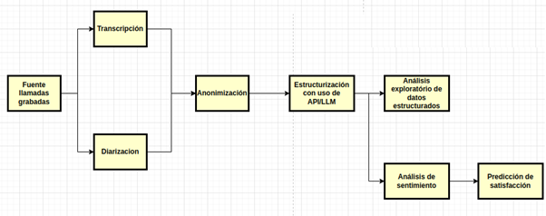

*End-to-end data processing diagram: from raw audio through diarisation, transcription, anonymisation, and structuring into tabular data.*

### Pipeline Stages

| Stage | Description | Technology |
|-------|-------------|------------|
| **Diarisation** | Identifies and separates speakers within each audio file | pyannote/speaker-diarization-3.1 (Hugging Face) |
| **Transcription** | Converts spoken audio to text | OpenAI Whisper (base model, ~74M parameters) |
| **Anonymisation** | Detects and redacts sensitive entities (names, phone numbers, emails, etc.) | Microsoft Presidio + spaCy (en_core_web_lg) |
| **Structuring** | Extracts structured fields, labels, and metadata from transcribed text | OpenAI GPT-4o-mini |

---

## 🛠️ Tools & Technologies

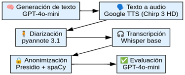

*Overview of the open-source and API-based tools used at each stage of the pipeline.*

| Component | Tool / Technology |
|-----------|------------------|
| Conversation generation | OpenAI GPT-4o-mini API |
| Text-to-speech synthesis | Google Cloud TTS — Chirp 3 HD |
| Speaker diarisation | pyannote/speaker-diarization-3.1 |
| Speech-to-text transcription | OpenAI Whisper (base) |
| Anonymisation engine | Microsoft Presidio (AnalyzerEngine) |
| NLP entity recognition | spaCy — en_core_web_lg |
| LLM structuring & labelling | OpenAI GPT-4o-mini API |
| Data processing & ML | Python, pandas, scikit-learn, imbalanced-learn |
| Class balancing | SMOTE / SMOTENC |
| Interpretability | SHAP library |
| Visualisation & dashboards | Power BI |
| Methodology | CRISP-DM (adapted) |

---

## 🔒 Anonymisation

Privacy protection was a core design principle throughout the project. Before any data analysis or storage takes place, all transcribed conversations pass through an **automated anonymisation pipeline** using **Microsoft Presidio** combined with **spaCy's** large English language model (`en_core_web_lg`, ~685K lexical entries, 343K unique vectors).

The anonymisation engine detects and redacts sensitive entity types including:
- Personal names (`<PERSON>`)
- Phone numbers (`<PHONE_NUMBER>`)
- Locations (`<LOCATION>`)
- Email addresses, credit card numbers, and other PII

**Sample anonymised output** (from initial testing with real-world conversations):

```json
[
  {"Speaker": "<IN_PAN>", "Text": " <PERSON> speaking, how can I help you?"},
  {"Speaker": "<LOCATION>", "Text": " Hello, this is <PERSON>. May I speak with <PERSON>?"},
  {"Speaker": "<LOCATION>", "Text": " She has my office number, but let me also give you my cell. It's <PHONE_NUMBER>."},
  {"Speaker": "<IN_PAN>", "Text": " Let me read that back to you. <PHONE_NUMBER>."}
]
```

*Initial anonymisation results from a test conversation. The `Text` fields show successful redaction of personal names (`<PERSON>`) and phone numbers (`<PHONE_NUMBER>`). The `Speaker` fields — normally populated by the diarisation stage with labels like `SPEAKER_01` — were also anonymised by Presidio in this run, replacing speaker names/company identifiers with entity-type placeholders (`<IN_PAN>`, `<LOCATION>`). This over-redaction of speaker labels was identified as an edge case to address in the anonymisation pipeline configuration.*

The solution was designed to run **locally within the organisation's own infrastructure**, ensuring that raw audio and transcriptions never leave the corporate network. This is a deliberate design choice to address the confidentiality requirements typical in call center environments.

---

## 📊 Bimester 9 — Exploratory Data Analysis Findings

The second academic course (Bimester 9) focused on **exploratory data analysis (EDA)** and the initial development of the machine learning model. The key findings are presented below.

### Call Duration Distribution

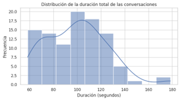

*Histogram showing the distribution of call durations across the dataset. The distribution reveals natural variation consistent with real call center patterns.*

### Duration by Resolution Outcome

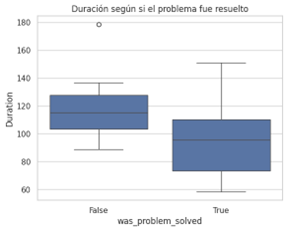

*Boxplot comparing call duration between resolved (True) and unresolved (False) calls. Unresolved calls tend to be significantly longer, suggesting extended troubleshooting without a successful outcome.*

### Pause Duration by Resolution Outcome

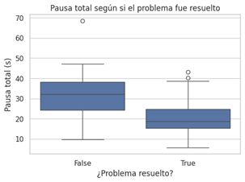

*Boxplot comparing total pause duration between resolved and unresolved calls. Longer pauses are associated with unresolved calls — reflecting the time agents spend attempting to resolve complex issues without success.*

### Correlation Matrix

After applying **Multi-Hot Encoding** to transform categorical tag columns into binary features, a correlation matrix was computed to identify relationships between variables.

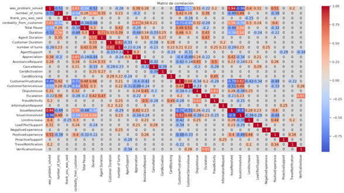

*Correlation matrix of all features after multi-hot encoding of call tags. Notable findings: customer cordiality shows a positive correlation with problem resolution; number of turns (customer speaking) correlates positively with customer cordiality.*

**Key observations:**
- **Cordiality and resolution are positively correlated** — suggesting a causal relationship: satisfied customers tend to be more cordial after their problem is resolved.
- Variables like `IssueResolved` and `IssueUnresolved` were removed as they duplicated information already captured by `was_problem_solved`.
- Most important features for predicting resolution (as estimated by Random Forest): `total_pause`, `duration`, `cordiality_from_customer`, `number_of_turns`, `customer_duration`.

### Unresolved Call Causes by Call Reason

To go beyond the surface-level outcome, an LLM was used to extract the **root causes** of unresolved calls. These tags were generated from transcribed text:

| Tag | Meaning |
|-----|---------|
| `RequiresAdditionalValidation` | Additional customer validation was needed |
| `SystemOutOfService` | A system error prevented the agent from completing the action |
| `IncorrectProcedure` | The agent followed an incorrect procedure |
| `LackOfAgentKnowledge` | The agent lacked the knowledge to resolve the issue |
| `NoSystemPermission` | The agent did not have the required system permissions |
| `ResponsibleDepartmentUnavailable` | The responsible department was not available |
| `BankPolicyRestriction` | The request conflicted with bank policy |
| `MissingCustomerInformation` | Required customer information was missing |

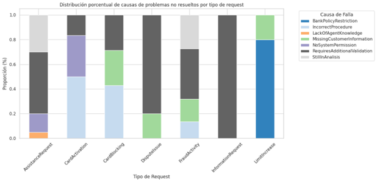

*Stacked bar chart showing the distribution of unresolved call causes grouped by call reason type. `RequiresAdditionalValidation` is the most frequent cause. For agent-attributable causes specifically: `IncorrectProcedure` accounts for 64.3% and `LackOfAgentKnowledge` 35.7%.*

### Unresolved Calls by Shift

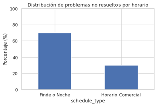

*Bar chart showing the proportion of unresolved calls broken down by day/night and weekday/weekend shifts. The proportion of unresolved calls is higher during night and weekend shifts — primarily driven by system outages rather than agent performance.*

**Actionable insight:** 100% of calls received on weekend nights correspond to card-blocking requests — a pattern likely linked to higher-risk environments (nightclubs, restaurants) and customer carelessness. This suggests a **dedicated specialised team for weekend night shifts** could significantly improve resolution rates.

### Bimester 9 Dashboard

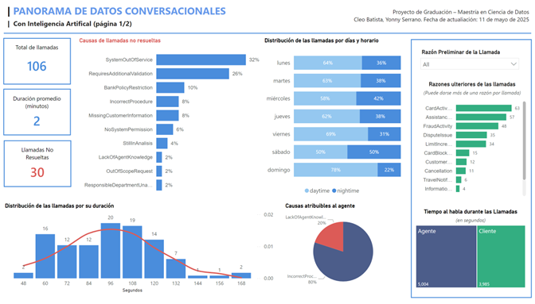

*Power BI dashboard (Bimester 9 version) presenting exploratory analysis results: call volume, resolution rates, call duration distributions, agent performance metrics, and shift-based breakdowns.*

---

## 🎯 Bimester 10 — Final Results

The third and final course (Bimester 10) delivered the complete, production-ready system — expanding the dataset with contextual variables, refining the ML model, adding SHAP interpretability, and publishing the final dashboards.

### Interpretability Analysis

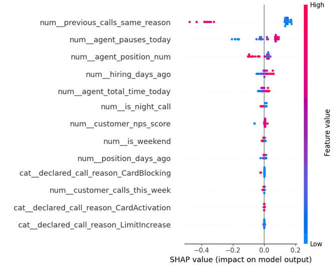

*Feature importance chart from the Random Forest model, highlighting the most influential variables for predicting call resolution. Variables related to agent experience, prior call history, and system pause patterns emerge as the strongest predictors.*

### Model Performance Comparison

Multiple classifiers were evaluated using 4-fold cross-validation on a SMOTE-balanced dataset:

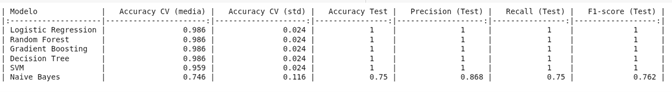

*Comparison of classification model performance (Accuracy, F1-score, Precision, Recall) across all evaluated models. All models except Naive Bayes achieved strong results. Random Forest was selected as the final model.*

| Model | Accuracy | Notes |
|-------|----------|-------|
| **Random Forest** | **98.6%** | Selected — best generalisation with hyperparameter tuning |
| Decision Tree | ~97% | Competitive but lower generalisation |
| SVM | ~100% (test) | Slight drop in training precision |
| Logistic Regression | ~95% | Good baseline |
| Naive Bayes | Lower | Not suitable for this feature space |

**Best hyperparameters (GridSearchCV):** `n_estimators=100`, `max_depth=None`, `min_samples_split=2`

### Random Forest Learning Curve

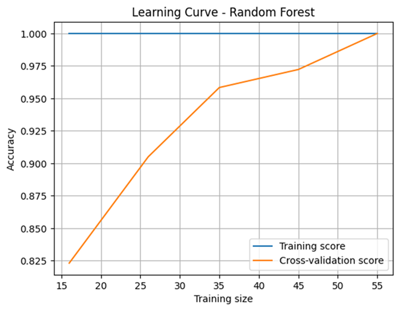

*Learning curve for the Random Forest model (trained on unbalanced data to avoid SMOTE artifacts in early splits). Training score remains at 1.00 throughout; cross-validation score improves from ~0.82 to 1.00 as the training set grows — indicating good generalisation capacity with more data.*

### SHAP Interpretability

To address the "black box" nature of Random Forest, **SHAP (SHapley Additive exPlanations)** was used to quantify each variable's contribution to individual predictions and overall model behaviour.


*SHAP beeswarm plot showing the contribution of each feature to the model's predictions. Red = high feature value, blue = low feature value. The most influential features are: prior calls by the same customer for the same reason, agent pauses before the call, agent experience (days since hiring), total call time today, and agent position.*

**Top predictors of call resolution:**
1. **Number of prior calls by the customer for the same reason** — repeat callers for the same issue significantly reduce the probability of resolution
2. **Agent pauses before the call** — agent fatigue or high workload correlates with lower resolution rates
3. **Agent experience** (days since hiring) — more experienced agents achieve better outcomes
4. **Total agent call time today** — burnout effect: agents handling many calls perform worse later in the shift
5. **Agent position** — higher-level agents resolve more complex issues

> **80% of unresolved calls are attributable to operational factors outside the agent's direct control** (system outages, missing validations, policy restrictions) — not to agent capability.

### Model Update Strategy

The project also proposes a **continuous learning framework** to keep the model current:

1. Random sampling of new calls for retraining
2. Periodic F1-score monitoring (weekly or per 30 new calls)
3. Automatic retraining triggered by a ≥5% drop in F1-score
4. Full pipeline rerun (cleaning → balancing → cross-validation)
5. Model versioning with rollback capability

### Final Dashboard


*Final Power BI dashboard (Page 1): Call center KPIs including total calls, unresolved call count, average duration, resolution rate by call type, and shift-based distribution. Designed for operational use by call center managers.*

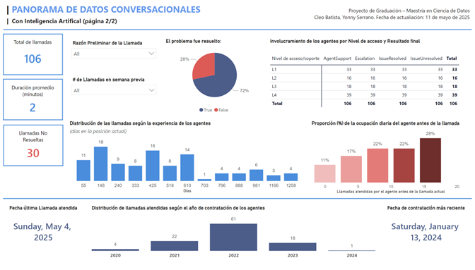

*Final Power BI dashboard (Page 2): Machine learning results including model classification outputs, SHAP feature importance visualisation, and agent-level performance metrics. Enables data-driven decision support for HR and operations teams.*

---

## 🎓 Academic Validation

This project was submitted as the **Final Graduation Activity (Actividad Final de Graduación — AFG)** for the **Master's in Data Science** at the **Pontificia Universidad Católica de Chile**, evaluated across three bimesters:

| Course | Period | Focus |
|--------|--------|-------|
| MDS3050 — AFG I | Bimester 8 (Dec 2024 – Feb 2025) | Problem definition, architecture design, data generation |
| MDS3060 — AFG II | Bimester 9 (Mar – May 2025) | Exploratory data analysis, initial ML model |
| MDS3070 — AFG III | Bimester 10 (May – Jul 2025) | Model refinement, SHAP, final dashboard, report |

The graduation exam was evaluated by a review panel from the Instituto de Ingeniería Matemática y Computacional (IMC UC) and resulted in:

> **✅ Result: Approved**
>
> *"En nombre de la Dirección Académica del Magíster en Ciencia de Datos, me complace informarte que la comisión revisora ha evaluado tu examen de grado con el resultado: Aprobado."*
>
> — Tamara Cucumides, Sub-Director, Master's in Data Science, PUC Chile (September 9, 2025)

---

## 🙋 My Contributions

This was a two-person team project. My specific contributions included:

- **Project conception and scope definition** — Identifying the call center analytics use case and framing it as a viable graduation project
- **Synthetic data generation** — Designing the conversation structure templates, configuring GPT-4o-mini prompts for diverse scenarios, and orchestrating the audio generation pipeline
- **Exploratory data analysis** — Performing and interpreting EDA, building the visualisations presented in Bimester 9
- **Machine learning model development** — Implementing the classification pipeline including data balancing (SMOTENC), feature engineering, cross-validation, and hyperparameter tuning
- **SHAP interpretability analysis** — Applying and interpreting SHAP values to ensure model transparency and explainability
- **Dashboard design and deployment** — Building the Power BI dashboards for both Bimester 9 and the final delivery
- **Report writing** — Co-authoring all three academic reports (AFG I, AFG II, AFG III)
- **Ethical framework** — Designing the anonymisation pipeline and the ethical principles framework (data minimisation, anonymisation, explainability, human oversight)

---

## 📁 Repository Note

This repository page serves as a **professional portfolio presentation** of the project. Source code is not publicly shared, as the project involves proprietary methodologies developed during a graduate programme and uses third-party APIs under specific terms.

The documents and images in this repository were included solely to support the portfolio narrative and do not constitute a distributable software package.

---

*Project completed: July 2025 | PUC Chile — Master's in Data Science*
