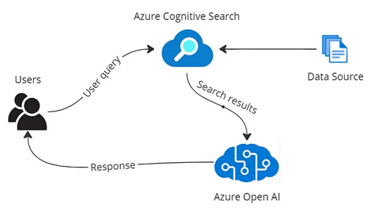
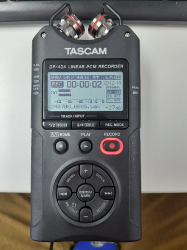
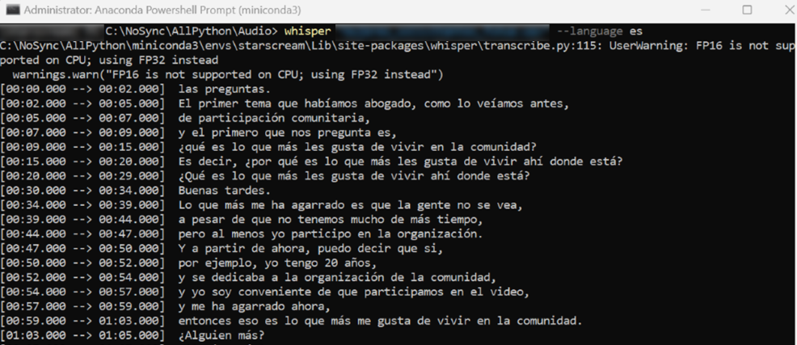
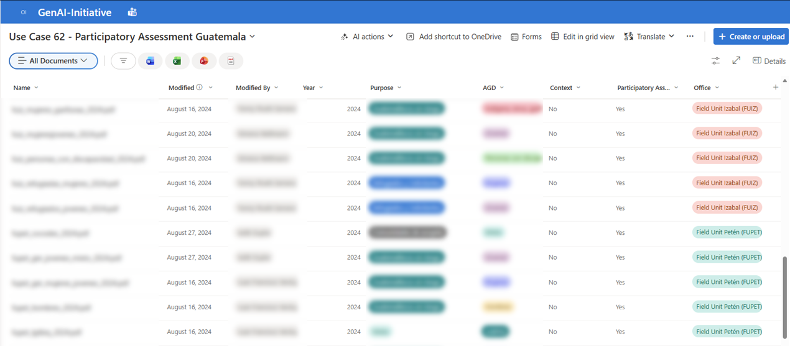
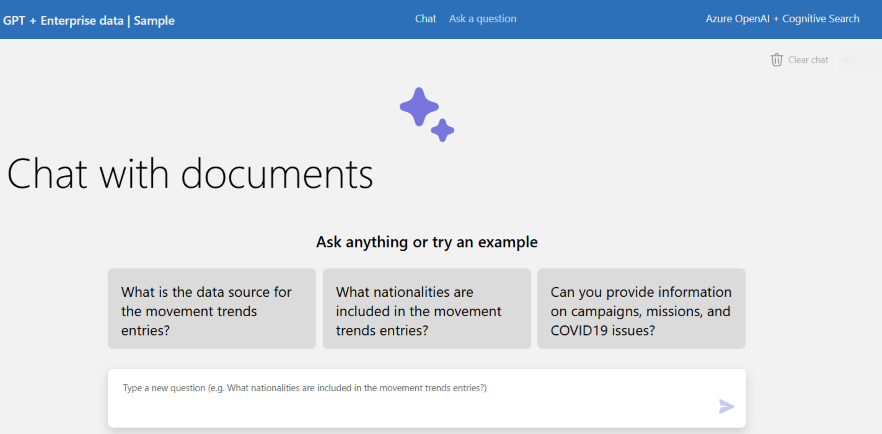
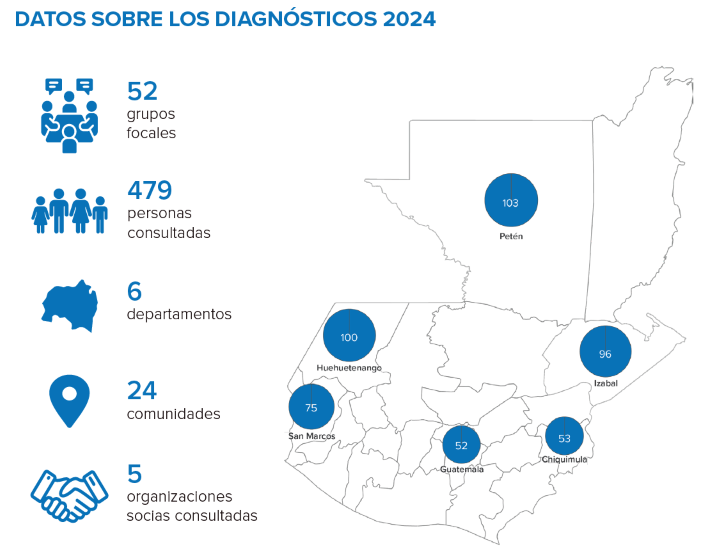

# 🎙️ LLM for Transcription & Analysis of Participatory Diagnostics with Refugees

---

## 📌 Project Overview

This project applies **Large Language Models (LLMs)** to enhance UNHCR's participatory assessment methodology for refugees and displaced people in Guatemala. The system converts field audio recordings of focus group discussions into anonymised, structured text, and feeds the results into a private LLM instance to enable qualitative analysis at scale.

The end-to-end workflow covers:

- **~50 focus group discussions** conducted nationally, with Age, Gender, and Diversity (AGD) disaggregation
- **Audio recording** in the field using professional recorders
- **Speech-to-text transcription** — using OpenAI Whisper for Spanish-language sessions, and manual transcription for Queqchi-language sessions
- **Anonymisation** of transcripts to protect participant confidentiality
- **LLM-powered analysis** through a secured, private Azure OpenAI + Cognitive Search instance deployed by UNHCR Headquarters Innovation
- **Prompt-driven qualitative research** — enabling staff to ask cross-cutting questions across all focus group transcripts

A core challenge this project addresses is the systematisation of qualitative data: each focus group generates six categories of structured output — protection risks and their causes, community capacities, proposed solutions, priority issues, and immediate follow-up actions — that must be consistently captured and then compared across communities, locations, and population groups. Traditional manual compilation was time-consuming and prone to loss of nuance; the LLM-based approach enables scalable, queryable analysis while preserving community voices.

---

## 🌍 Humanitarian Scenario

UNHCR's participatory assessment methodology asks communities to identify protection risks, community capacities, and proposed solutions — and to prioritise the most urgent needs. Traditionally, the results of these exercises have been compiled manually, which is time-consuming, prone to loss of qualitative nuance, and difficult to compare across communities.

In Guatemala, the operation conducts dozens of focus group discussions each year with:
- Refugees and asylum seekers
- Internally displaced people
- Indigenous communities (including Mayan populations such as Queqchi speakers)
- Disaggregated groups: women, men, youth, older persons, persons with disabilities

> *"In previous years we have used a semi-closed form to facilitate the collection work, but a lot of qualitative information is lost. Using GenAI would allow us to analyse the needs, capacities, and proposed solutions more accurately for displaced people in Guatemala."*
>
> — UNHCR Guatemala request for HQ GenAI access

The challenge is to systematise and analyse this rich, qualitative data — collected across many communities and in multiple languages — in a way that preserves its nuance while enabling operational use by protection staff.

---

## 💡 Solution Overview

The project implements a four-stage pipeline that transforms raw field audio into structured, query-ready qualitative data:

| Stage | Description | Technology |
|-------|-------------|------------|
| **1. Audio Recording** | Field recording of focus group sessions with professional recorders | Tascam DR-series recorder (WAV 16-bit, 44.1 kHz) |
| **2. Speech to Text** | Local transcription of audio to PDF documents | OpenAI Whisper (medium / large models); manual transcription for Queqchi |
| **3. Anonymisation** | Removal of names, addresses, places, and other identifying information | Text processing / manual review |
| **4. LLM Analysis** | Loading anonymised PDFs into a private LLM instance for prompt-driven analysis | Azure OpenAI + Cognitive Search (UNHCR HQ private instance) |

The pipeline was designed with **data protection as a core constraint**: all local processing (transcription, anonymisation) happens on a dedicated workstation within the operation's own infrastructure, ensuring that raw audio and personally identifiable information never leave the organisation's environment before anonymisation is complete.

**Sample prompts used in the analysis phase:**

> *"Answer as if you were an experienced UNHCR Child Protection Officer and highlight the main protection risks affecting children and adolescents in the western part of the country. If they have also suggested proposals to mitigate them, list them as well. Illustrate your answer with some literal quotes from what was expressed in the focus groups by the children and adolescents."*

> *"Respond as a diversity and inclusion specialist. What are the main specific needs faced by Mayan people in Guatemala? Are there any that particularly affect them because of their ethnicity compared to other population groups? Illustrate your answer with verbatim quotes from the Mayan population."*

---

## 🏗️ Architecture & Data Flow

The architecture relies on a secured private instance of **Azure OpenAI** combined with **Azure Cognitive Search**, set up by UNHCR Headquarters Innovation. Anonymised PDF transcripts are injected into the knowledge base, and protection staff interact with the data through customised prompts.

*Data flow: anonymised focus group transcripts are indexed via Azure Cognitive Search and queried through a customised Azure OpenAI instance. Staff interact with the system using protection-specific prompts to extract thematic insights across all sessions.*

**Key design decisions:**

- **Private, secured instance** — the LLM is not a public service; it is a UNHCR-internal deployment managed by HQ Innovation, ensuring data stays within organisational boundaries.
- **PDF injection** — transcripts are loaded as documents, enabling the model to reference source material and cite verbatim quotes in its responses.
- **Customised prompts** — default prompts are tailored for UNHCR's protection mandate, enabling non-technical staff to conduct qualitative research without programming skills.
- **Reusability** — the setup can be reused by other UNHCR country operations running similar participatory assessment cycles.

---

## 🎤 Field Data Collection Workflow

### Focus Group Facilitation

Sessions followed a standardised facilitation protocol to ensure quality, consistency, and participant safety. Each session lasted a maximum of 120 minutes with up to 10 participants, held in a private, low-noise space. The facilitator led a structured question sequence (less sensitive topics first), used open-ended probes, and ensured equal speaking space for all participants. A digital notetaker captured content in parallel throughout.

**Informed consent for participation and audio recording** was obtained from each participant at the start — either through a signed consent form or a verbal declaration recorded on the device. Sessions where consent was not given were not recorded.

### Audio Recording

A dedicated recorder guide was prepared to ensure consistent, high-quality audio capture across all field teams. The Tascam DR-series recorder was used, configured in WAV format for compatibility with Whisper transcription.

*Starting a session: press RECORD once to enter standby mode (red light blinks), then press RECORD again to begin. The HOLD button is engaged immediately after to prevent accidental interruptions during the session.*

After the session, the recording is transferred to a shared folder and the Information Management (IM) team is notified with the file name and session reference.

---

## 🔤 Transcription Approach

### Whisper — Initial Field Testing

Initial field testing used **OpenAI Whisper** (medium and large models) running **locally** on a dedicated workstation to ensure data protection. Whisper was selected for its strong multilingual support and the ability to run entirely offline.

*Terminal screenshot showing Whisper running during the initial testing phase on a field laptop unit in Huehuetenango. The process was later migrated to a GPU server to improve throughput and processing speed.*

**Key lessons from Whisper testing:**

- Initial recordings required **audio noise reduction** (using WavePad) before transcription to achieve acceptable confidence levels
- Target confidence levels were **80–90%** for usable transcripts
- **Whisper medium and large** models were needed for best results in noisy field conditions
- Some focus group sessions were **not recorded** because participants did not give consent for audio capture — in these cases, only manual notes were used

### Manual Transcription for Queqchi Sessions

Whisper was not used for sessions conducted in **Queqchi**, one of the Mayan languages spoken by indigenous communities in Guatemala. Whisper's multilingual models do not provide reliable coverage for low-resource indigenous languages, and attempting automated transcription would have produced unusable output.

For these sessions, **manual transcription** was carried out. The transcription preserves the spoken content in Spanish (in cases where participants code-switched) and in transliterated form for Queqchi-language contributions.

An illustrative fragment from the youth Queqchi focus group (Huehuetenango, 2024) reflects the type of qualitative content captured:

> *"Lo más difícil para obtener información es cuando se va la señal, que a veces necesitamos recibir o tener alguna información acerca de lo que está sucediendo, pues se va la señal o no tenemos internet."*

> *"El tema sobre el desarrollo comunitario y los derechos, especialmente, la manera de cómo convivir con otras culturas, en virtud que, la población garífuna nos discrimina y no nos dan espacio para poder expresarnos."*

These themes — connectivity barriers, inter-ethnic discrimination, access to rights — are examples of the nuanced, community-specific insights that emerged from the Queqchi sessions and would have been inaccessible without a manual transcription approach.

---

## 📂 Document Repository

Anonymised transcripts and supporting session materials are stored and classified in a dedicated **SharePoint document library** configured for GenAI integration. The library uses custom metadata columns — department, population group (AGD category), session type, spoken language, and thematic tags — so that the Azure Cognitive Search indexer can surface the most relevant documents for each analyst query.

*The SharePoint document library set up for the participatory assessment project. Custom classification columns allow protection staff to filter results by geographic area, population group, or session type, improving the precision of cross-cutting thematic analysis.*

The library structure mirrors the six output categories of the participatory methodology (protection risks, root causes, community capacities, proposed solutions, priority issues, and immediate follow-up actions), making it straightforward to locate the transcript evidence behind any finding in the final report.

Key metadata columns include: **Year**, **Purpose** (e.g. refugees, host communities, partners), **AGD Context** (women, youth, LGBTIQ+, indigenous, etc.), **Participatory Assessment** flag, **Office**, and **Field Unit** — together enabling targeted filtering and downstream GenAI queries.

---

## 💬 Chatbot Interface

Protection and Information Management staff interact with the indexed transcript corpus through a **dedicated chatbot page** hosted within UNHCR Guatemala's intranet environment. The interface connects to the private Azure OpenAI + Cognitive Search instance and accepts both predefined analytical prompts and free-text questions in Spanish or English.

*The chatbot interface used by analysts to query the transcript repository. Responses are grounded in verbatim transcript content, with source citations that allow report authors to verify or expand any finding.*

The page was intentionally designed for non-technical users: protection officers and report authors can interrogate the entire corpus using natural language — no programming or structured query syntax required — significantly lowering the barrier to evidence-based analysis.

The chatbot is explicitly scoped to the same document set described in the SharePoint library, so every response draws from the actual assessment transcripts rather than general model knowledge.

---

## 📋 Methodology

The 2024 participatory assessment cycle applied UNHCR's Community-based Protection methodology across multiple departments of Guatemala. Focus groups were conducted with age-, gender-, and diversity-disaggregated groups — women, men, youth, older persons, persons with disabilities, and indigenous communities — to surface protection risks, community capacities, and proposed solutions specific to each group.

Each session was structured around six categories of output: protection risks, root causes, community capacities, proposed solutions, priority issues, and immediate follow-up actions. This structure, illustrated in the information systematisation diagram described in the Project Overview, enabled consistent comparison across communities, locations, and population groups — the very challenge the LLM pipeline was designed to address.

**Geographic coverage**

*Geographic distribution of participatory assessment sessions across Guatemala (2024), showing the number of focus groups and participants disaggregated by department and population group. The coverage spans multiple regions and diversity categories, producing a large qualitative dataset that the LLM system was designed to make queryable.*

**From recording to indexed knowledge**

Field audio (WAV recordings from Tascam DR-series recorders) was processed through the transcription pipeline described in the Transcription section, then anonymised and loaded as PDFs into the SharePoint library. The Azure Cognitive Search component — shown in the Architecture flowchart — indexed the documents, enabling the chatbot to retrieve relevant transcript passages in response to analyst queries. Manual transcription handled sessions conducted in Queqchi, which fell outside Whisper's reliable language coverage.

The 2024 cycle comprised **52 focus groups** across **6 departments**, consulting a total of **479 people** — including refugees, asylum seekers, Guatemalans at risk, and humanitarian workers — with an average of 9 participants per session. Sessions were structured around an AGD lens, capturing perspectives from women, men, children, LGBTIQ+ persons, older persons, and indigenous (Mayan, Garífuna, Xinca) communities. Six thematic areas guided the discussions: community participation, communication with communities, security, gender-based violence, climate change, and access to the refugee status determination procedure. The integration of AI-assisted transcription and a purpose-built chatbot for querying results was highlighted in the methodology as an innovative element of this exercise.

> *These figures and the methodology description are drawn from the final assessment report.*

---

## 📊 Results & Operational Value

The LLM-enabled workflow produced concrete improvements over the previous manual process for synthesising participatory assessment results.

| Benefit | Description |
|---------|-------------|
| **Speed of synthesis** | Cross-cutting thematic analysis across dozens of sessions — previously a multi-day manual task — could be completed in minutes using targeted prompts against the indexed corpus |
| **Retrieval and traceability** | Every chatbot response cites the source transcript, allowing report authors to verify findings and retrieve verbatim quotes for the final report |
| **Multilingual handling** | The pipeline accommodated Spanish (Whisper-transcribed), Queqchi (manually transcribed), and mixed-language queries from analysts, surfacing insights that would otherwise require separate manual review of each language group |
| **Improved reporting workflow** | Protection staff producing the final assessment report used the chatbot to query thematic patterns and validate cross-cutting findings, reducing compilation time and increasing confidence in the evidence base |
| **Replicability** | The architecture, library configuration, and prompt library can be adapted by other UNHCR country operations running similar participatory assessment cycles |

**Operational observations from the team**

Post-deployment reflections highlighted both the effectiveness and the limitations of the pipeline in practice:

- **Audio quality** remained the primary constraint on transcription accuracy: background noise and overlapping speakers were the main sources of errors, even with high-quality field recorders and audio pre-processing (WavePad noise reduction).
- **Mayan language handling** required manual intervention — the model was unable to reliably process Queqchi-language segments within otherwise Spanish-language sessions, confirming the need for a dedicated manual transcription track.
- **Prompt precision** had a significant impact on output quality: early tests showed the model sometimes retrieved facilitator explanations rather than participant responses when the same thematic terms were used by both. Iterative prompt refinement resolved most of these issues.

> *This page does not reproduce specific statistical findings or outcomes from the final assessment report, which is an internal UNHCR document. Results described here reflect the operational experience and workflow benefits observed by the team.*

---

## 🔒 Data Governance & Ethics

Data protection and ethical principles were integrated into every stage of the workflow:

| Principle | Implementation |
|-----------|---------------|
| **Informed consent** | Verbal or written consent obtained from each participant before recording; sessions where consent was not given were not recorded |
| **Data minimisation** | Transcripts contain only discussion content — no biometric data, identity documents, or case-specific personal history |
| **Anonymisation** | All transcripts are cleaned to remove names, addresses, locations, and other identifying data points before being loaded into any system |
| **Local processing** | Transcription and anonymisation run on locally managed hardware; raw audio never leaves the operation's infrastructure |
| **Secure model access** | The LLM instance is a private, UNHCR-managed deployment — not a public API service — ensuring organisational data sovereignty |
| **Access control** | Only authorised protection and IM staff interact with the LLM system |
| **Participant safety** | Facilitators are trained to redirect participants who begin sharing sensitive personal case details, protecting them from inadvertently disclosing harmful information |

---

## 🙋 My Contributions

This was a collaborative effort involving field protection officers, Information Management staff, and the UNHCR HQ Innovation team. My role focused on the technical operationalisation of the pipeline.

**Directly involved in:**

- **Whisper setup and transcription runs** — Configuring OpenAI Whisper, benchmarking model sizes (medium vs. large), and running the full transcription pipeline on a dedicated GPU server set up for this project
- **Transcription quality** — Reviewing and cleaning transcripts, applying audio noise reduction (WavePad), and establishing target confidence thresholds for usable output
- **GPU server setup** — Provisioning and configuring the server environment used for efficient batch transcription
- **SharePoint library configuration** — Defining custom metadata columns, data types, and classification options in the document library to support accurate retrieval by Azure Cognitive Search
- **Instructions for field colleagues** — Preparing guidance on how to upload session files to SharePoint with the correct naming and metadata conventions
- **Prompt engineering** — Designing, testing, and refining protection-oriented prompts; coordinating with UNHCR HQ Innovation for model refinement and retraining
- **Reporting support** — Supporting colleagues responsible for producing the final assessment report in using the chatbot effectively to retrieve and verify evidence

**Not directly involved in:**

- Field recorder hardware setup and configuration
- Producing the focus group facilitation guide, recorder manual, and internal knowledge-sharing presentation materials (these were produced by other team members)

The project relied on the expertise of field protection officers who conducted the focus groups, community volunteers and interpreters who supported Queqchi-language sessions, and the UNHCR HQ Innovation team who managed the LLM infrastructure.

---

## 📁 Current Status

| Component | Status |
|-----------|--------|
| Field audio recording | ✅ Completed across ~80 focus group sessions |
| Whisper transcription (Spanish sessions) | ✅ Completed |
| Manual transcription (Queqchi sessions) | ✅ Completed |
| Anonymisation | ✅ Completed |
| SharePoint document library | ✅ Configured and operational |
| Azure OpenAI + Cognitive Search setup | ✅ Operational |
| Chatbot interface | ✅ Deployed and in use |
| Prompt library | ✅ Designed, tested, and refined |
| Final assessment report | ✅ Completed by the protection team |

---

## 📁 Repository Note

This page is a **professional portfolio presentation** of the project. Source code, raw transcripts, and audio files are not publicly shared in compliance with UNHCR data protection policies and participant confidentiality commitments.

The images and documents included here were shared by the project team solely to support this portfolio narrative.

---

*Project context: UNHCR Guatemala Participatory Assessments 2024*
